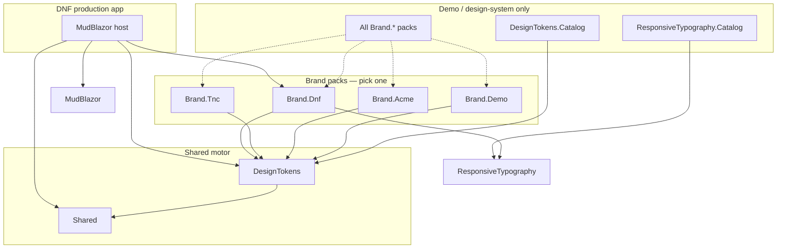

# Brand packages — install guide

Install **one brand pack** per MudBlazor app. The generic motor (`DesignTokens`) stays shared; brand colors, recipes, and pairing rules live in `Brand.*` packages.

## Dependency diagram



## Versioning

| Layer | Example | Purpose |
|-------|---------|---------|
| **NuGet** | `2.0.0` (`NerdBrandPackageVersion` in `Directory.Build.props`) | Package release |
| **Identity** | `2025.1` on `INerdBrandPack.IdentityVersion` | Brand guide revision (shown in catalog) |
| **Client pack** | `NerdTokenPack.Version` (int) | Saved client override revision |

Brand packages require `TheNerdCollective.MudComponents.DesignTokens` ≥ 2.0.0. See `CHANGELOG.md` in each `Brand.*` package.

## JSON-first token packs (v2)

Built-in brands (`Tnc`, `Dnf`, `Acme`, `Demo`) load from **embedded** `reference/brands/*.token-pack.json` in the `DesignTokens` package. C# presets remain for tests and enrichment; runtime source of truth is JSON.

| Field | Purpose |
|-------|---------|
| `brandId` / `displayName` | Catalog labels and workbook onboarding |
| `approvedPairings` + `pairingGuideName` | Hydrates `NerdJsonPairingPolicy` (studio dropdowns, recipe validation) |
| `lockedTokens` | Blocks Live Token Studio edits (e.g. TNC `navy`/`coral`) |
| Recipe `label` / `usage` | Workbook + preview template copy |

**Onboard a client without code:**

1. Open `/nerd-brand-workbook` (or import on `/nerd-design-tokens`).
2. Upload `token-pack.json` (schema v2 in `schema/token-pack.schema.json`).
3. Review palette, aliases, recipes; export updated JSON.

```csharp
// Production: still one brand package OR import at runtime in design tooling
builder.Services.AddNerdDesignTokenCatalog();
app.MapRazorComponents<App>()
    .AddNerdDesignTokenCatalog(app.Services);
```

## Quick reference

| App type | Packages | DI |
|----------|----------|-----|
| **DNF produktion** | `Shared` + `DesignTokens` + `Brand.Dnf` (+ `ResponsiveTypography` for typography) | `AddNerdDnfBrand()` / `AddNerdDnfDesignSystem()` |
| **TNC produktion** | `Shared` + `DesignTokens` + `Brand.Tnc` | `AddNerdTncBrand()` |
| **Sample / Acme** | `Shared` + `DesignTokens` + `Brand.Acme` | `AddNerdAcmeBrand()` |
| **Internal demo** | All `Brand.*` + catalogs | `AddNerdDesignTokenBrandPacks(...)` |

## DNF (Danmarks Naturfredningsforening)

```xml
<PackageReference Include="TheNerdCollective.MudComponents.Shared" />
<PackageReference Include="TheNerdCollective.MudComponents.DesignTokens" />
<PackageReference Include="TheNerdCollective.Brand.Dnf" />
```

```csharp
using TheNerdCollective.Brand.Dnf;

builder.Services.AddMudServices();
builder.Services.AddNerdDnfBrand(options =>
{
    options.RestrictCatalogToDevelopment = true;
});
```

Includes: 12 identity colors (identity **2025.1**), recipes, semantic aliases, opacity tokens, pairing policy, and optional typography via `AddNerdDnfTypography()` / `AddNerdDnfDesignSystem()`.

```csharp
builder.Services.AddNerdDnfDesignSystem(); // tokens + typography
```

See [src/TheNerdCollective.Brand.Dnf/README.md](../src/TheNerdCollective.Brand.Dnf/README.md).

## TNC (The Nerd Collective)

```xml
<PackageReference Include="TheNerdCollective.Brand.Tnc" />
```

```csharp
using TheNerdCollective.Brand.Tnc;

builder.Services.AddNerdTncBrand();
```

Includes: `navy`, `coral`, `snow`, `ink`, `chalk` + recipes (`hero`, `header`, `tagline`, `cta`) + **TNC pairing policy** (4 recipe pairs).

## Acme (sample brand)

```csharp
using TheNerdCollective.Brand.Acme;

builder.Services.AddNerdAcmeBrand();
```

## Demo (sample brand)

```csharp
using TheNerdCollective.Brand.Demo;

builder.Services.AddNerdDemoBrand();
```

## Design-system host (alle brands)

For catalog brand-switcher and hub — **not** for production customer apps:

```csharp
using TheNerdCollective.Brand.Acme;
using TheNerdCollective.Brand.Demo;
using TheNerdCollective.Brand.Dnf;
using TheNerdCollective.Brand.Tnc;

builder.Services.AddNerdDesignTokenBrandPacks(
    NerdDnfBrandPack.Instance,
    NerdAcmeBrandPack.Instance,
    NerdDemoBrandPack.Instance,
    NerdTncBrandPack.Instance);

builder.Services.AddNerdDesignTokens(options =>
{
    NerdBrandPackRegistry.Instance.Configure("tnc", options);
});
builder.Services.AddNerdDesignTokenCatalog();

app.MapRazorComponents<App>()
    .AddNerdDesignTokenCatalog(app.Services)
    .AddNerdDesignSystemHub(app.Services);
```

## Markup

After DI, add styles once in `App.razor`:

```razor
<MudThemeProvider />
<NerdDesignTokenStyles />
```

Use token classes from the active brand prefix (`dnf-skov`, `tnc-navy`, …) or semantic aliases (`dnf-primary-action`).

## Custom overrides

Brand packs configure `NerdDesignTokenOptions`. You can extend after the brand call:

```csharp
builder.Services.AddNerdDnfBrand(options =>
{
    options.Add("custom", new NerdColorToken { Value = "#AABBCC", ContrastText = "#111111" });
});
```

Or load a client pack from JSON via `INerdTokenPackStore` (see DesignTokens README).

## Architecture

Full plan: [00-brand-packages-plan.md](00-backlogs/00-brand-packages-plan.md)
